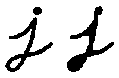
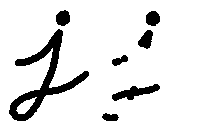

# morphologyEx
这次尝试使用OpenCV2.14中的
<a class="reference external" href="http://opencv.jp/opencv-2.2_org/cpp/imgproc_image_filtering.html?highlight=morphology#morphologyEx">morphologyEx</a>函数进行进一步的形态变化：
<ul>
<li>开运算 (Opening)</li>
<li>闭运算 (Closing)</li>
<li>形态梯度 (Morphological Gradient)</li>
<li>顶帽 (Top Hat)</li>
<li>黑帽 (Black Hat)</li>
</ul>

<h2>原理</h2>
<ol>
<li>开运算 (Opening)
<ul>
<li>开运算是通过先对图像腐蚀再膨胀实现的。

</li>
<li>能够排除小团块物体(假设物体较背景明亮)</li>
<li>请看下面，左图是原图像，右图是采用开运算转换之后的结果图。 观察发现字母拐弯处的白色空间消失。

</li>
</ul>
</li>
<li>闭运算 (Closing)
<ul>
<li>闭运算是通过先对图像膨胀再腐蚀实现的。

</li>
<li>能够排除小型黑洞(黑色区域)。

</li>
</ul>
</li>
<li>形态梯度 (Morphological Gradient)
<ul>
<li>
膨胀图与腐蚀图之差

</li>
<li>能够保留物体的边缘轮廓，如下所示:

</li>
</ul>
</li>
<li>顶帽 (Top Hat)
<ul>
<li>原图像与开运算结果图之差:

 

</li>
</ul>
</li>
<li>黑帽 (Black Hat)
<ul>
<li>闭运算结果图与原图像之差:

 

</li>
</ul>
</li>
</ol>

<h2>代码解释</h2>
<code>
<pre>
void Morphology_Operations(int, void*)
{
	// 由于 MORPH_X的取值范围是: 2,3,4,5 和 6
	int operation = morph_operator + 2;
	Mat element = getStructuringElement(morph_elem, 
					Size(2 * morph_size + 1, 2 * morph_size + 1), 
					Point(morph_size, morph_size));
	// 运行指定形态学操作
	morphologyEx(src, dst, operation, element);
	imshow(window_name, dst);
}
</pre>
</code>
运行形态学操作的核心函数是 <a class="reference external" href="http://opencv.jp/opencv-2.2_org/cpp/imgproc_image_filtering.html?highlight=morphology#morphologyEx">morphologyEx</a> 。在本例中，我们使用了4个参数(其余使用默认值):

<ul>
<li><strong>src</strong> : 原 (输入) 图像</li>
<li><strong>dst</strong>: 输出图像</li>
<li><strong>operation</strong>: 需要运行的形态学操作。 我们有5个选项:
<ul>
<li><em>Opening</em>: MORPH_OPEN : 2</li>
<li><em>Closing</em>: MORPH_CLOSE: 3</li>
<li><em>Gradient</em>: MORPH_GRADIENT: 4</li>
<li><em>Top Hat</em>: MORPH_TOPHAT: 5</li>
<li><em>Black Hat</em>: MORPH_BLACKHAT: 6</li>
</ul>	
<li><strong>element</strong>: 内核，可以使用函数:get_structuring_element:<cite>getStructuringElement &lt;&gt;</cite> 自定义。</li>
</ul>
